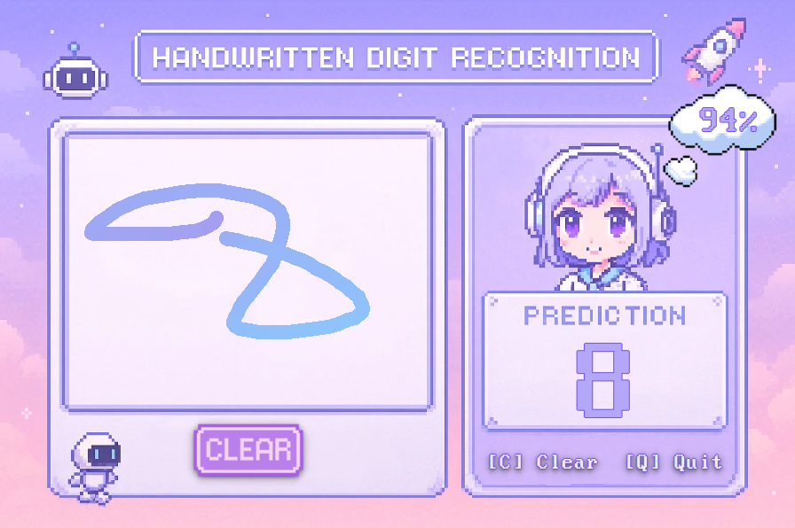

## Preview


Draw a digit 0-9 and the app will guess what it is.

## Features

* Drewing canvas
* Shows predicted digit and confidence
* Clean and fun user interface
* Press `C` to clear, `Q` to quit

## How to Run

1. **Install requirements**:

```bash
pip install -r requirements.txt
```

2. **Run it with**:

```bash
python app.py
```